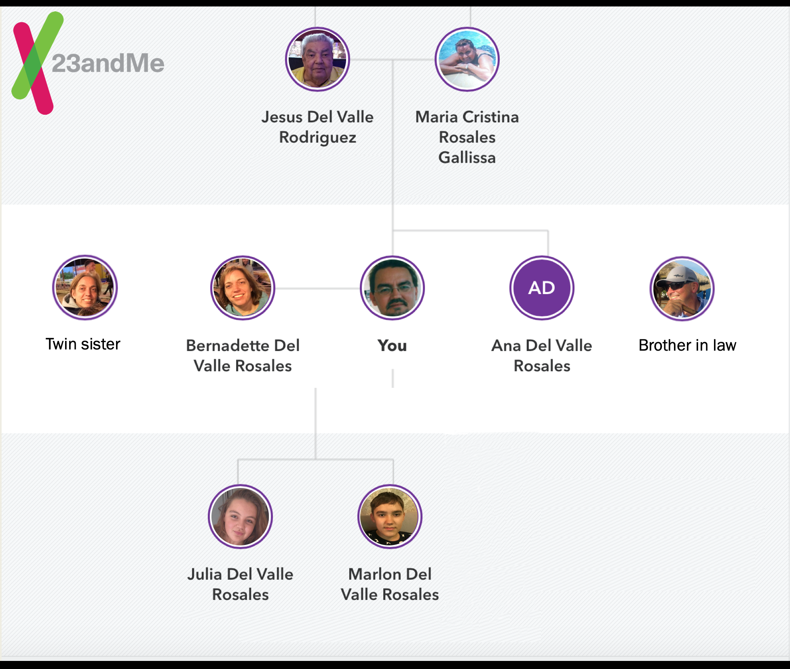

# Jesus del Valle

We are Team Read. Here we go with KarinKM, MarjoriePoG, Fabiola The CoG, and Kiliana The Killer.

## Departments I have worked over the years

- R&D
- Marketing
- IT

## Hackathons

1. MIT
2. Duke

I currently work at ** [Bayer] (https://www.bayer.com) ** in _Berlin_ at the `R&D Open Innovation Stranger Things` department.

### Links

- [GitLab] (https://gitlab.com/yeysus)
- [Bitbucket] (https://bitbucket.org/yeysus/)
- [Stack Overflow] (https://stackexchange.com/users/9531598/jesus-del-valle)
- [ResearchGate] (https://www.researchgate.net/profile/Jesus_Del_Valle)
- [ORCID] (https://orcid.org/0000-0001-5998-6298)
- [Semantic Scholar] (https://www.semanticscholar.org/author/J.-Del-Valle/50606902)
- [Google Scholar] (https://scholar.google.com/citations?user=_nI0_wMAAAAJ&hl=en)
- [Academia.edu] (https://bayer.academia.edu/JesusdelValle)
- [Meetup] (https://www.meetup.com/members/45080772/)
- [Xing] (https://www.xing.com/profile/Jesus_delValle/cv)
- [Medium] (https://medium.com/@yeysus)
- [Reddit] (https://www.reddit.com/user/jesusdelvalle/)
- [Thingiverse] (https://www.thingiverse.com/yeysus/designs)
- [Tinkercad] (https://www.tinkercad.com/users/g8IvGd2EvDb-jesus-del-valle/)
- [Instagram] (https://www.instagram.com/jesusdelvaller/)
- [YouTube] (https://www.youtube.com/channel/UC2suGh_JaOFOUMs3gg1iIXA)
- [SoundCloud] (https://soundcloud.com/yeysus)

### Useful Links for GitHub Pages

- [GitHub Pages Documentation](https://docs.github.com/categories/github-pages-basics/)
- [GitHub Flavored Markdown](https://guides.github.com/features/mastering-markdown/)
- [Repository settings](https://github.com/yeysus/yeysus.github.io/settings)

