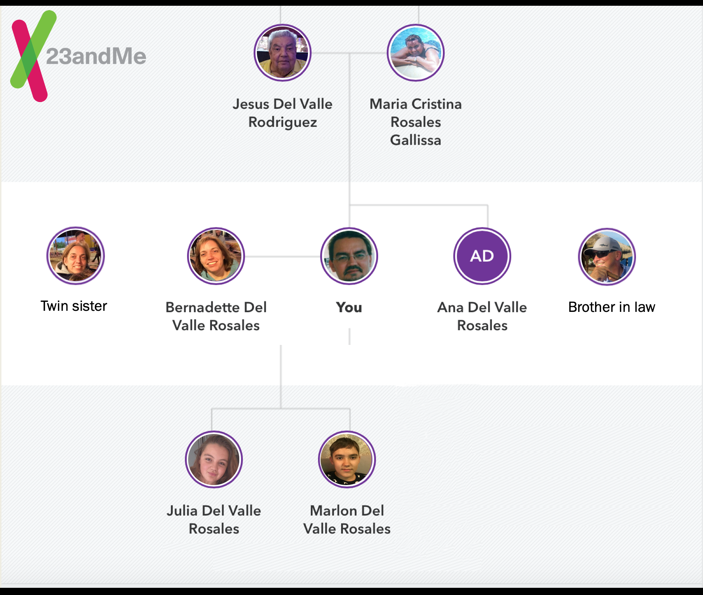

# Jesus del Valle

Jesus del Valle is originally from Havana, Cuba. He graduated as a Physicist (Diploma / Master) from the Technical University of Dresden, obtained his PhD in Biology at the Max Planck Institute / Free University in Berlin, and has worked in Life Sciences for more than 20 years. At **Bayer** he started working in IT in R&D and M&S roles, and currently leads the Stranger Things Team at Bayer Pharmaceuticals R&D Open Innovation. He founded the Bayer Grants4Apps / G4A open innovation initiative in 2013, first pharma startups accelerator, which has since evolved into a digital health for life sciences accelerator and coworking program with locations in multiple countries. He founded the global STEM4Health community, https://www.meetup.com/pro/stem4health/, now with 15,000+ members, to foster networking between all stakeholders in the healthcare industry. Jesus also co-founded **AcceleRed**, a company building project. AcceleRed is among other initiatives co-organizing Hackathons online and have been volunteering as Co-organizers, Mentors, Judges, in different Hackathons, Universities of Yale, Cambridge (UK), MIT, Duke, Princeton HighSchool, others. One of his passions is to bring together the startups’ culture and technological knowledge with Bayer’s experience. Twitter: https://twitter.com/yeysus. LinkedIn: https://www.linkedin.com/in/yeysus/.

## Departments

- R&D
- Marketing
- IT

## Volunteering at Hackathons

1. CruzHacks, University of California Santa Cruz, [Web](https://www.cruzhacks.com), [Twitter](https://twitter.com/CruzHacks), [Devpost](https://cruzhacks-2021.devpost.com/)
2. CUNY Hackathon, The City University of New York, [Web](https://cunystartups.com/hackathon21/), [Devpost](https://the-cuny-hackathon-2021.devpost.com/)
3. Hack Health, Stony Brook University, [Web](https://www3.cs.stonybrook.edu/~wics/hackhealth/), [Devpost](https://hackhealth-2021.devpost.com/)
4. Hex Cambridge, Cambridge University, [Web](https://hackcambridge.com), [Twitter](https://twitter.com/Hack_Cambridge), [Devpost](https://hex-cambridge.devpost.com/)
5. Hack The North, University of Waterloo, [Web](https://hackthenorth.com), [Twitter](https://twitter.com/HackTheNorth), [Devpost](https://hackthenorth2020.devpost.com/)
6. Hackabull, University of South Florida, [Web](https://hackabull.io/), [Twitter](https://twitter.com/hackabull), [Devpost](https://hackabull2021.devpost.com/)
7. HackDuke, Duke University, [Web](https://hackduke.org), [Twitter](https://twitter.com/HackDuke), [Devpost](https://code-for-good.devpost.com/)
8. hackPHS, Princeton High School, [Web](https://hackphs.tech), [Twitter](https://twitter.com/theHackPhs), [Devpost](https://hackphs-2020.devpost.com/)
9. HackSC, University of Southern California, [Web](https://hacksc.com/), [Twitter](https://twitter.com/hackscofficial), [Devpost](https://hacksc2021.devpost.com/)
10. HackUMass, University of Massachusetts, [Web](https://hackumass.com), [Twitter](https://twitter.com/hackumass)
11. HackUTD, University of Texas at Dallas, [Web](https://www.hackutd.co/), [Twitter](https://twitter.com/hackutd), [Devpost](https://hackutd-vii.devpost.com/)
12. ISPE Hackathon, International Society for Pharmaceutical Engineering, [Web](https://ispe.org/conferences/ispe-student-recent-graduate-international-virtual-hackathon)
13. MakeHarvard, Harvard University, [Web](https://www.makeharvard.io/), [Twitter](https://twitter.com/makeharvard), [Devpost](https://makeharvard-2021.devpost.com/)
14. MIT Beat the Pandemic I, Massachusetts Institute of Technology, [Web](https://covid19challenge.mit.edu/beat-the-pandemic/), [Twitter](https://twitter.com/MITvsCOVID19)
15. MIT Beat the Pandemic II, Massachusetts Institute of Technology, [Web](https://covid19challenge.mit.edu/beat-the-pandemic-2/), [Twitter](https://twitter.com/MITvsCOVID19)
16. MIT Building for Digital Health, Massachusetts Institute of Technology, [Web](https://hackingmedicine.mit.edu/building-for-digital-health/), [Twitter](https://twitter.com/mithackmed)
17. MIT Latin America vs. Covid-19, Massachusetts Institute of Technology, [Web](https://covid19challenge.mit.edu/latam-vs-covid19/), [Twitter](https://twitter.com/MITvsCOVID19)
18. MIT Hacking Racism in Healthcare, Massachusetts Institute of Technology, [Web](https://hackingracism.mit.edu), [Twitter](https://twitter.com/MITHackRacism)
19. nwHacks, University of British Columbia, [Web](https://www.nwhacks.io), [Twitter](https://twitter.com/nwplusubc), [Devpost](https://nwhacks2021.devpost.com/)
20. PatriotHacks, George Mason University, [Web](https://patriothacks.org/), [Twitter](https://twitter.com/patriothacks), [Devpost](https://patriothacks-hh.devpost.com/)
21. SB Hacks, University of California Santa Barbara, [Web](https://sbhacks.com), [Twitter](https://twitter.com/SB_Hacks), [Devpost](https://sb-hacks-vii.devpost.com/)
22. SDHacks, University of California San Diego, [Web](http://www.sdhacks.io/), [Twitter](https://twitter.com/SDHacks), [Devpost](https://sd-hacks-2021.devpost.com/)
23. SF Hacks, San Francisco State University, [Web](https://sfhacks.io/), [Twitter](https://twitter.com/SF_Hacks), [Devpost](https://sf-hacks.devpost.com/)
24. SteelHacks, University of Pittsburgh, [Web](https://steelhacks.com), [Twitter](https://twitter.com/pittsteelhacks), [Devpost](https://steelhacks-2021.devpost.com/)
25. SwampHacks, University of Florida, [Web](https://2021.swamphacks.com), [Twitter](https://twitter.com/swamphacks), [Devpost](https://swamphacks-vii.devpost.com/)
26. TAMUhack, Texas A&M University, [Web](https://tamuhack.com), [Twitter](https://twitter.com/tamuhack), [Devpost](https://tamuhack2021.devpost.com/)
27. TartanHacks, Carnegie Mellon University, [Web](https://tartanhacks.com/), [Twitter](https://twitter.com/TartanHacks), [Devpost](https://tartanhacks-2021.devpost.com/)
28. TreeHacks, Stanford University, [Web](https://treehacks.com/), [Twitter](https://twitter.com/hackwithtrees), [Devpost](https://treehacks-2021.devpost.com/)
29. UGAHacks, University of Georgia, [Web](https://6.ugahacks.com/), [Twitter](https://twitter.com/ugahacks), [Devpost](https://ugahacks-6.devpost.com/)
30. Yale CBIT Health Hackathon, Yale University, [Web](http://yalehackhealth.org), [Twitter](https://twitter.com/YaleHackHealth), [Devpost](https://yale-hack-health.devpost.com/)
31. YHack, Yale University, [Web](https://www.yhack.org), [Twitter](https://twitter.com/YaleHack), [Devpost](https://yhack2020.devpost.com/)

View in a Map [here](./hackathons_map.html).

## 23andMe

Human genetics is a theme that fascinates me. I have tested myself and 7 members of my family using the 23andMe kit, which I consider by far the most valuable resource for "getting to know myself" out there.

## Flutter

Personal notes of working with Flutter are [here](./flutter.md).

## WebRTC

Read about what I have found regarding WebRTC compatibility [here](./webrtc.html).

## Where to buy Hardware / Consumer Electronics stuff

- 96 Boards, [Web](https://www.96boards.org/products/ce/)
- Adafruit, [Web](https://www.adafruit.com)
- Antratek, [Web](https://www.antratek.de/)
- Arrow, [Web](https://www.arrow.com), Resellers from Google's Coral
- BerryBase, [Web](https://www.berrybase.de), Berlin
- conrad, [Web](https://www.conrad.de)
- Mouser, [Web](https://www.mouser.de), Resellers from Google's Coral
- Paradisetronic, [Web](https://paradisetronic.com), Berlin
- Pimoroni, [Web](https://shop.pimoroni.com)
- Pollin, [Web](https://www.pollin.de)
- Pololu, [Web](https://www.pololu.com)
- reichelt, [Web](https://www.reichelt.de)
- Seeed, [Web](https://www.seeedstudio.com/), Resellers from Google's Coral

## Social Links

- [GitLab](https://gitlab.com/yeysus)
- [Bitbucket](https://bitbucket.org/yeysus/)
- [Stack Overflow](https://stackexchange.com/users/9531598/jesus-del-valle)
- [ResearchGate](https://www.researchgate.net/profile/Jesus_Del_Valle)
- [ORCID](https://orcid.org/0000-0001-5998-6298)
- [Semantic Scholar](https://www.semanticscholar.org/author/J.-Del-Valle/50606902)
- [Google Scholar](https://scholar.google.com/citations?user=_nI0_wMAAAAJ&hl=en)
- [Academia.edu](https://bayer.academia.edu/JesusdelValle)
- [Meetup](https://www.meetup.com/members/45080772/)
- [Xing](https://www.xing.com/profile/Jesus_delValle/cv)
- [Medium](https://medium.com/@yeysus)
- [Reddit](https://www.reddit.com/user/jesusdelvalle/)
- [Thingiverse](https://www.thingiverse.com/yeysus/designs)
- [Tinkercad](https://www.tinkercad.com/users/g8IvGd2EvDb-jesus-del-valle/)
- [Instagram](https://www.instagram.com/jesusdelvaller/)
- [YouTube](https://www.youtube.com/channel/UC2suGh_JaOFOUMs3gg1iIXA)
- [SoundCloud](https://soundcloud.com/yeysus)

## AcceleRed Team Members

| AcceleRed | GitHub | LinkedIn | Twitter |
| --- | --- | --- | --- |
| Fabiola Fajardo | [FabyFF](https://fabyff.github.io) | [FabiolaFajardoFregoso](https://www.linkedin.com/in/fabiola-fajardo-fregoso-74432a19/) | [DagnySande](https://twitter.com/dagnysande) |
| Karin Müller | [KarinKM](https://karinkm.github.io) | [KarinMüller](https://www.linkedin.com/in/karin-müller-078a201a3/) | [KYepitsme](https://twitter.com/KYepitsme) |
| Kiliana Suzart-Woischnik | [KSuzart](https://ksuzart.github.io) | [KilianaSuzartWoischnik](https://www.linkedin.com/in/kiliana-suzart-woischnik-b4353a66/) | [SuzartK](https://twitter.com/suzartk?lang=en) |
| Marjorie Gómez | [YoSoyMayonesa](https://yosoymayonesa.github.io) | [MarjorieGomezB](https://www.linkedin.com/in/marjorie-gomez-mgb/) | [YoSoyMayonesa](https://twitter.com/YoSoyMayonesa) |
| Tatjana Gust | | [TatjanaGust](https://www.linkedin.com/in/tatjana-gust-4b7a0299/) ||

## HackSciTech

Get ready for a Biotech Hackathon [here](./hackscitech/index.html).
