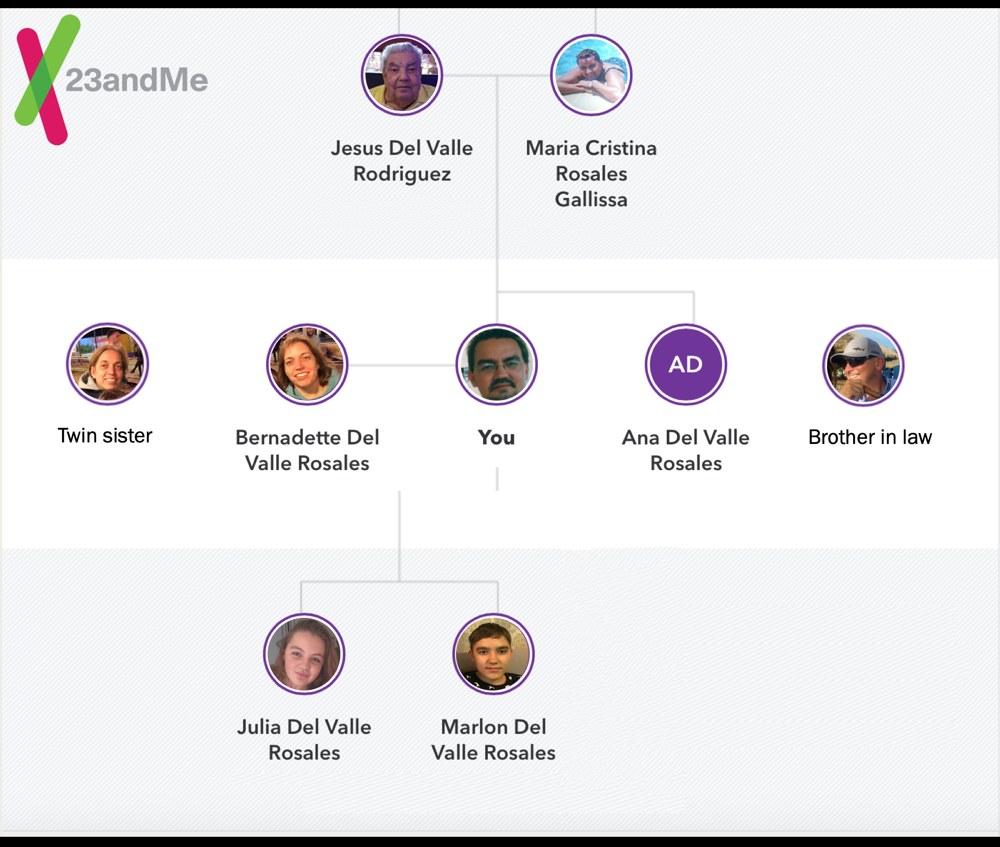

# Jesus del Valle

Jesus del Valle is originally from Havana, Cuba. He graduated as a Physicist (Diploma / Master) from the Technical University of Dresden, obtained his PhD in Biology at the Max Planck Institute / Free University in Berlin, and has worked in Life Sciences for more than 20 years. At **Bayer** he started working in IT in R&D and M&S roles, and currently leads the Stranger Things Team at Bayer Pharmaceuticals R&D Open Innovation. He founded the Bayer Grants4Apps / G4A open innovation initiative in 2013, first pharma startups accelerator, which has since evolved into a digital health for life sciences accelerator and coworking program with locations in multiple countries. He founded the global STEM4Health community, https://www.meetup.com/pro/stem4health/, now with 15,000+ members, to foster networking between all stakeholders in the healthcare industry. Jesus also co-founded **AcceleRed**, a company building project. AcceleRed is among other initiatives co-organizing Hackathons online and have been volunteering as Co-organizers, Mentors, Judges, in different Hackathons, Universities of Yale, Cambridge (UK), MIT, Duke, Princeton, Stanford, Harvard, others. One of his passions is to bring together the startups’ culture and technological knowledge with Bayer’s experience. Twitter: https://twitter.com/yeysus. LinkedIn: https://www.linkedin.com/in/yeysus/.

## Departments

- R&D
- Marketing
- IT

## Volunteering at Hackathons

1. CatHacks, University of Kentucky, [Web](http://cathacks.cs.uky.edu/), [Twitter](https://twitter.com/UKCatHacks), [Devpost](https://cathacks-vii.devpost.com/)
2. CruzHacks, University of California Santa Cruz, [Web](https://www.cruzhacks.com), [Twitter](https://twitter.com/CruzHacks), [Devpost](https://cruzhacks-2021.devpost.com/)
3. CUNY Hackathon, The City University of New York, [Web](https://cunystartups.com/hackathon21/), [Devpost](https://the-cuny-hackathon-2021.devpost.com/)
4. Hack Health, Stony Brook University, [Web](https://www3.cs.stonybrook.edu/~wics/hackhealth/), [Devpost](https://hackhealth-2021.devpost.com/)
5. Hex Cambridge, Cambridge University, [Web](https://hackcambridge.com), [Twitter](https://twitter.com/Hack_Cambridge), [Devpost](https://hex-cambridge.devpost.com/)
6. Hack The North, University of Waterloo, [Web](https://hackthenorth.com), [Twitter](https://twitter.com/HackTheNorth), [Devpost](https://hackthenorth2020.devpost.com/)
7. Hackabull, University of South Florida, [Web](https://hackabull.io/), [Twitter](https://twitter.com/hackabull), [Devpost](https://hackabull2021.devpost.com/)
8. HackDuke, Duke University, [Web](https://hackduke.org), [Twitter](https://twitter.com/HackDuke), [Devpost](https://code-for-good.devpost.com/)
9. hackPHS, Princeton High School, [Web](https://hackphs.tech), [Twitter](https://twitter.com/theHackPhs), [Devpost](https://hackphs-2020.devpost.com/)
10. HackPrinceton, Princeton University, [Web](https://www.hackprinceton.com), [Twitter](https://twitter.com/hackprinceton), [Devpost](https://hackprinceton21.devpost.com)
11. HackSC, University of Southern California, [Web](https://hacksc.com/), [Twitter](https://twitter.com/hackscofficial), [Devpost](https://hacksc2021.devpost.com/)
12. HackUMass, University of Massachusetts, [Web](https://hackumass.com), [Twitter](https://twitter.com/hackumass)
13. HackUTD, University of Texas at Dallas, [Web](https://www.hackutd.co/), [Twitter](https://twitter.com/hackutd), [Devpost](https://hackutd-vii.devpost.com/)
14. ISPE Hackathon, International Society for Pharmaceutical Engineering, [Web](https://ispe.org/conferences/ispe-student-recent-graduate-international-virtual-hackathon)
15. LA Hacks, University of California Los Angeles, [Web](https://lahacks.com/), [Twitter](https://twitter.com/lahacks), [Devpost](https://la-hacks-2021.devpost.com)
16. MakeHarvard, Harvard University, [Web](https://www.makeharvard.io/), [Twitter](https://twitter.com/makeharvard), [Devpost](https://makeharvard-2021.devpost.com/)
17. MIT Beat the Pandemic I, Massachusetts Institute of Technology, [Web](https://covid19challenge.mit.edu/beat-the-pandemic/), [Twitter](https://twitter.com/MITvsCOVID19)
18. MIT Beat the Pandemic II, Massachusetts Institute of Technology, [Web](https://covid19challenge.mit.edu/beat-the-pandemic-2/), [Twitter](https://twitter.com/MITvsCOVID19)
19. MIT Building for Digital Health, Massachusetts Institute of Technology, [Web](https://hackingmedicine.mit.edu/building-for-digital-health/), [Twitter](https://twitter.com/mithackmed)
20. MIT Latin America vs. Covid-19, Massachusetts Institute of Technology, [Web](https://covid19challenge.mit.edu/latam-vs-covid19/), [Twitter](https://twitter.com/MITvsCOVID19)
21. MIT Hacking Racism in Healthcare, Massachusetts Institute of Technology, [Web](https://hackingracism.mit.edu), [Twitter](https://twitter.com/MITHackRacism)
22. nwHacks, University of British Columbia, [Web](https://www.nwhacks.io), [Twitter](https://twitter.com/nwplusubc), [Devpost](https://nwhacks2021.devpost.com/)
23. PatriotHacks, George Mason University, [Web](https://patriothacks.org/), [Twitter](https://twitter.com/patriothacks), [Devpost](https://patriothacks-hh.devpost.com/)
24. RowdyHacks, University of Texas at San Antonio, [Web](https://www.rowdyhacks.io/), [Twitter](https://twitter.com/RowdyHacks), [Devpost](https://rowdyhacks2021.devpost.com/)
25. SB Hacks, University of California Santa Barbara, [Web](https://sbhacks.com), [Twitter](https://twitter.com/SB_Hacks), [Devpost](https://sb-hacks-vii.devpost.com/)
26. SDHacks, University of California San Diego, [Web](http://www.sdhacks.io/), [Twitter](https://twitter.com/SDHacks), [Devpost](https://sd-hacks-2021.devpost.com/)
27. SF Hacks, San Francisco State University, [Web](https://sfhacks.io/), [Twitter](https://twitter.com/SF_Hacks), [Devpost](https://sf-hacks.devpost.com/)
28. SteelHacks, University of Pittsburgh, [Web](https://steelhacks.com), [Twitter](https://twitter.com/pittsteelhacks), [Devpost](https://steelhacks-2021.devpost.com/)
29. SwampHacks, University of Florida, [Web](https://2021.swamphacks.com), [Twitter](https://twitter.com/swamphacks), [Devpost](https://swamphacks-vii.devpost.com/)
30. TAMUhack, Texas A&M University, [Web](https://tamuhack.com), [Twitter](https://twitter.com/tamuhack), [Devpost](https://tamuhack2021.devpost.com/)
31. TartanHacks, Carnegie Mellon University, [Web](https://tartanhacks.com/), [Twitter](https://twitter.com/TartanHacks), [Devpost](https://tartanhacks-2021.devpost.com/)
32. TreeHacks, Stanford University, [Web](https://treehacks.com/), [Twitter](https://twitter.com/hackwithtrees), [Devpost](https://treehacks-2021.devpost.com/)
33. UGAHacks, University of Georgia, [Web](https://6.ugahacks.com/), [Twitter](https://twitter.com/ugahacks), [Devpost](https://ugahacks-6.devpost.com/)
34. Yale CBIT Health Hackathon, Yale University, [Web](http://yalehackhealth.org), [Twitter](https://twitter.com/YaleHackHealth), [Devpost](https://yale-hack-health.devpost.com/)
35. YHack, Yale University, [Web](https://www.yhack.org), [Twitter](https://twitter.com/YaleHack), [Devpost](https://yhack2020.devpost.com/)

View in a Map [here](./hackathons_map.html).

## Posts about Vibe Coding Hackathons I co-organized

| Name | LinkedIn | Date | Reason | Company |
| --- | --- | --- | --- | --- |
| Stefan Oelrich | [LinkedIn](https://www.linkedin.com/feed/update/urn:li:activity:7397639870124511233/) | 2025-11-21 | Lions Cave 2025 | Bayer |
| Iman Amayri | [LinkedIn](https://www.linkedin.com/feed/update/urn:li:activity:7390015916048142336/) | 2025-01-10 | Veeva 2025 | Bayer |
| Katharina Schmid | [LinkedIn](https://www.linkedin.com/feed/update/urn:li:activity:7390069781686714369/) | 2025-01-11 | PS 2025 | Bayer |
| Yvonne Nanciu | [LinkedIn](https://www.linkedin.com/feed/update/urn:li:activity:7390010781813141504/) | 2025-01-11 | PV 2025 | Bayer |
| Tala M. Basha | [LinkedIn](https://www.linkedin.com/feed/update/urn:li:activity:7396925244566929408/) | 2025-11-14 | MENA 2025 | Bayer |
| Anu Mathews | [LinkedIn](https://www.linkedin.com/feed/update/urn:li:activity:7394962033055780864/) | 2025-11-14 | MENA 2025 | Bayer |
| Christopher Blaesing | [LinkedIn](https://www.linkedin.com/posts/christopher-blaesing_aihackathon-innovation-teamwork-ugcPost-7395029626592526336-A4Jy) | 2025-11-14 | MENA 2025 | Bayer |
| Jan Oerkermann | [LinkedIn](https://www.linkedin.com/posts/jan-oerkermann-2a1020113_teambayer-onebayer-genai-ugcPost-7394674033738424320-PnT9) | 2025-11-17 | Pre Lions Cave 2025 | Bayer |
| Monil Parmar | [LinkedIn](https://www.linkedin.com/feed/update/urn:li:activity:7394733655375630336/) | 2025-11-18 | MENA 2025 | Bayer |
| Shashank Gupta | [LinkedIn](https://www.linkedin.com/feed/update/urn:li:activity:7394774513579606017/) | 2025-11-19 | MENA 2025 | Bayer |
| Jesus del Valle | [LinkedIn](https://www.linkedin.com/posts/yeysus_vibecoding-hackathons-teambayer-activity-7397022127440269312-E6bG) | 2025-11-19 | Pre Lions Cave 2025 | Bayer |
| Krysia Sommers | [LinkedIn](https://www.linkedin.com/posts/krysia-sommers_ai-dso-teambayer-activity-7395828059049775104-jkH3) | 2025-11-19 | Pre Lions Cave 2025 | Bayer |
| Jan Oerkermann | [LinkedIn](https://www.linkedin.com/feed/update/urn:li:activity:7397531154108608512/) | 2025-11-21 | Lions Cave 2025 | Bayer |
| Danny Allen | [LinkedIn](https://www.linkedin.com/feed/update/urn:li:activity:7397622528262795264/) | 2025-11-21 | Lions Cave 2025 | Bayer |
| Alexander Alex | [LinkedIn](https://www.linkedin.com/feed/update/urn:li:activity:7397650208764895232/) | 2025-11-21 | Lions Cave 2025 | Bayer |
| Torsten Weber | [LinkedIn](https://www.linkedin.com/feed/update/urn:li:activity:7397658726335352832/) | 2025-11-22 | Lions Cave 2025 | Bayer |
| Maik Lange | [LinkedIn](https://www.linkedin.com/feed/update/urn:li:activity:7397909864171184128/) | 2025-11-22 | Lions Cave 2025 | Bayer |
| Robert Westphal | [LinkedIn](https://www.linkedin.com/feed/update/urn:li:activity:7397994456899145728/) | 2025-11-23 | Lions Cave 2025 | Bayer |
| Sandra Brauer | [LinkedIn](https://www.linkedin.com/feed/update/urn:li:activity:7398000348709273600/) | 2025-11-23 | Lions Cave 2025 | Bayer |
| David Vrieze | [LinkedIn](https://www.linkedin.com/feed/update/urn:li:activity:7398043673046933504/) | 2025-11-24 | Lions Cave 2025 | Bayer |
| Dennis Lettau | [LinkedIn](https://www.linkedin.com/feed/update/urn:li:activity:7398635240056926208/) | 2025-11-24 | Lions Cave 2025 | Bayer |
| Kristin May | [LinkedIn](https://www.linkedin.com/feed/update/urn:li:activity:7398698017895108608/) | 2025-11-24 | Lions Cave 2025 | Bayer |
| Charles Potenza | [LinkedIn](https://www.linkedin.com/feed/update/urn:li:activity:7398814808541696001/) | 2025-11-24 | Lions Cave 2025 | Bayer |
| Bettina von Streit | [LinkedIn](https://www.linkedin.com/feed/update/urn:li:activity:7398996947732324352/) | 2025-11-25 | Lions Cave 2025 | Bayer |
| Bernardo Reis Cardoso | [LinkedIn](https://www.linkedin.com/feed/update/urn:li:activity:7399123132495831040/) | 2025-11-25 | Lions Cave 2025 | Bayer |
| Assia Aziza Boukhiar | [LinkedIn](https://www.linkedin.com/posts/activity-7399720666758799360-j5wK/) | 2025-11-27 | Lions Cave 2025 | Bayer |
| Monil Parmar | [LinkedIn](https://www.linkedin.com/feed/update/urn:li:activity:7399847024017350657/) | 2025-11-27 | MENA 2025 | Bayer |
| Mennatallah Aly | [LinkedIn](https://www.linkedin.com/feed/update/urn:li:activity:7399873912723021825/) | 2025-11-27 | MENA 2025 | Bayer |
| Menna Tawfik | [LinkedIn](https://www.linkedin.com/feed/update/urn:li:activity:7399865201635954690/) | 2025-11-27 | MENA 2025 | Bayer |
| Danny Allen | [LinkedIn](https://www.linkedin.com/feed/update/urn:li:activity:7399921602949206016/) | 2025-11-27 | MENA 2025 | Bayer |
| Assia Aziza Boukhiar Baahmed | [LinkedIn](https://www.linkedin.com/feed/update/urn:li:activity:7399720666758799360/) | 2025-11-27 | Lions Cave 2025 | Bayer |
| Ahmed Hanoun | [LinkedIn](https://www.linkedin.com/feed/update/urn:li:activity:7400046788100993025/) | 2025-11-28 | MENA 2025 | Bayer |
| Christian Mueller | [LinkedIn](https://www.linkedin.com/feed/update/urn:li:activity:7400067284951638016/) | 2025-11-28 | Lions Cave 2025 | Bayer |
| Sacha Baulan | [LinkedIn](https://www.linkedin.com/feed/update/urn:li:activity:7400174623834804225/) | 2025-11-28 | Lions Cave 2025 | Bayer |
| Tala M. Basha | [LinkedIn](https://www.linkedin.com/feed/update/urn:li:activity:7400476836452904960/) | 2025-11-29 | MENA 2025 | Bayer |
| Sherif Emad | [LinkedIn](https://www.linkedin.com/feed/update/urn:li:activity:7400470697527029760/) | 2025-11-29 | MENA 2025 | Bayer |
| Sabine Kessler | [LinkedIn](https://www.linkedin.com/feed/update/urn:li:activity:7401185077512151041/) | 2025-01-12 | CEP 2025 | Bayer |
| Jan Hoffmann | [LinkedIn](https://www.linkedin.com/feed/update/urn:li:activity:7401290621069656064/) | 2025-01-12 | CEP 2025 | Bayer |
| Maria Veronica Garay | [LinkedIn](https://www.linkedin.com/feed/update/urn:li:activity:7401580923873378306/) | 2025-02-12 | RnD 2025 | Bayer |
| Dorothy Gondwe | [LinkedIn](https://www.linkedin.com/feed/update/urn:li:activity:7401678401717030913/) | 2025-02-12 | RnD 2025 | Bayer |
| Christian Czech | [LinkedIn](https://www.linkedin.com/feed/update/urn:li:activity:7402316636759908352/) | 2025-04-12 | RnD 2025 | Bayer |
| Iman Amayri | [LinkedIn](https://www.linkedin.com/feed/update/urn:li:activity:7402349736097157120/) | 2025-04-12 | Lions Cave 2025 | Bayer |
| Amarilys Navarrete | [LinkedIn](https://www.linkedin.com/feed/update/urn:li:activity:7404537363562938368/) | 2025-11-12 | PS 2025 | Bayer |
| Alexander Alex | [LinkedIn](https://www.linkedin.com/posts/alexanderalexberlin_teambayer-byronbar-vibecoding-activity-7343880687902466049-30-x) | 2025-05-01 | Berlin 2025 | Bayer |
| Sarunas Vaitkus | [LinkedIn](https://www.linkedin.com/posts/vaitkus_teambayer-vibecoding-activity-7343913029845028864-qDwa) | 2025-01-01 | USA 2025 | Bayer |
| Yvonne Nanciu | [LinkedIn](https://www.linkedin.com/posts/ynanciu_teambayer-pharmacovigilance-vibecoding-activity-7343911497024061441-l0gt) | 2025-07-01 | Leverkusen 2025 | Bayer |
| Maria Engelmann | [LinkedIn](https://www.linkedin.com/posts/maria-engelmann-180059335_teambayer-bayerengineering-innovatewithai-activity-7343885360394907651-FjmX) | 2025-07-01 | Leverkusen 2025 | Bayer |
| Anna Bredlich | [LinkedIn](https://www.linkedin.com/posts/anna-bredlich-25801a290_certificate-of-paticipation-activity-7343655440217530368-JZmw) | 2025-07-01 | Leverkusen 2025 | Bayer |
| Bettina von Streit | [LinkedIn](https://www.linkedin.com/posts/bettina-von-streit-7830197_certificate-activity-7343983267492061184-M-kc) | 2025-05-01 | Berlin 2025 | Bayer |
| Ozlem Arisoy | [LinkedIn](https://www.linkedin.com/posts/activity-7341237669315641344-Ag0s) | 2025-01-01 | USA 2025 | Bayer |
| Vedad Boberg Fazlic | [LinkedIn](https://www.linkedin.com/posts/vedad-boberg-fazlic_i-like-the-energy-of-punk-rock-i-like-activity-7338856127108993025-qpn6) | 2025-07-01 | Leverkusen 2025 | Bayer |
| Pia Hahn | [LinkedIn](https://www.linkedin.com/posts/pia-hahn-9610431a8_teambayer-bayerengineering-teambayer-activity-7338660726825205762-436f) | 2025-07-01 | Leverkusen 2025 | Bayer |
| Christopher Blaesing | [LinkedIn](https://www.linkedin.com/posts/christopher-blaesing_genai-stem4health-llm-ugcPost-7330689423719755776-sorR) | 2025-05-01 | Berlin 2025 | Bayer |
| Robert Westphal | [LinkedIn](https://www.linkedin.com/posts/robert-westphal-a0971482_byronbar-byronbar-ugcPost-7321545704693288960-Fh8W) | 2025-05-01 | Berlin 2025 | Bayer |
| Bettina von Streit | [LinkedIn](https://www.linkedin.com/posts/bettina-von-streit-7830197_byronbar-byronbar-ugcPost-7321556352600850433-PGIr) | 2025-05-01 | Berlin 2025 | Bayer |
| Robert Westphal | [LinkedIn](https://www.linkedin.com/posts/robert-westphal-a0971482_teambayer-teambayer-vibecodinghackathon-activity-7344296743439679488-_Q1U) | 2025-07-01 | USA 2025 | Bayer |
| Kristin May | [LinkedIn](https://www.linkedin.com/posts/kristin-may-943b53230_bayer-hackathon-innovation-activity-7344323746234593281-8Q4z) | 2025-07-01 | USA 2025 | Bayer |
| Claudia Pietsch | [LinkedIn](https://www.linkedin.com/posts/claudia-pietsch-0116256a_teambayer-pharmacovigilance-vibecoding-activity-7344508035962220544-kqqS) | 2025-05-01 | Berlin 2025 | Bayer |
| Alex Ramos Soszna | [LinkedIn](https://www.linkedin.com/posts/mario-ramossoszna_still-riding-the-high-from-last-weeks-bayer-activity-7344484207445884928-kwZ4) | 2025-07-01 | USA 2025 | Bayer |
| Raymart Dela Cruz | [LinkedIn](https://www.linkedin.com/posts/raymart-dela-cruz-cpa-4047365a_excited-to-share-that-i-received-a-certificate-activity-7344693648971702272-09La) | 2025-07-01 | USA 2025 | Bayer |
| Stefan Hinterkeuser-Baumert | [LinkedIn](https://www.linkedin.com/posts/hinterkeuser-baumert_genai-hackathon-vibecoding-activity-7344685513095757824-MGFB) | 2025-07-01 | Leverkusen 2025 | Bayer |
| Sebastian Tyralski | [LinkedIn](https://www.linkedin.com/posts/sebastian-tyralski-a352581a0_teambayer-vibecodinghackathon-byron-activity-7345488800724221952-6nvy/) | 2025-05-01 | Berlin 2025 | Bayer |
| Zikun Wu | [LinkedIn](https://www.linkedin.com/posts/zikunwu_vibecoding-vibecoding-teambayer-activity-7345534269651329024-rCqZ) | 2025-07-01 | USA 2025 | Bayer |
| Mathew Ratnam | [LinkedIn](https://www.linkedin.com/posts/mathew-r-ratnam_pharmaai-hackathon-innovation-activity-7345574588119957504-Mkar/) | 2025-07-01 | USA 2025 | Bayer |
| Sheila Elz | [LinkedIn](https://www.linkedin.com/posts/sheila-elz-34880332_hackathon-genai-innovation-activity-7345814352156934147-vXsF/) | 2025-05-01 | Berlin 2025 | Bayer |
| Sevda Adigüzel | [LinkedIn](https://www.linkedin.com/posts/activity-7346111116772618242-Sp67) | 2025-01-01 | Leverkusen 2025 | Bayer |
| Amy Nardella | [LinkedIn](https://www.linkedin.com/posts/amywiener_i-was-honored-and-excited-to-be-included-activity-7346205520032096257-IWRC) | 2025-07-01 | USA 2025 | Bayer |
| Robert Vlad | [LinkedIn](https://www.linkedin.com/posts/robert-vlad_vibecoding-activity-7346363817116790785-VIJi) | 2025-07-01 | USA 2025 | Bayer |
| David Vrieze | [LinkedIn](https://www.linkedin.com/posts/activity-7346832258298798082-LpzO) | 2025-07-01 | USA 2025 | Bayer |
| Ayaz M | [LinkedIn](https://www.linkedin.com/posts/ayaz-m-3918a635_excited-to-share-that-i-received-a-certificate-activity-7346834199884025856-zyWw) | 2025-07-01 | USA 2025 | Bayer |
| Maik Lange | [LinkedIn](https://www.linkedin.com/posts/webjets_aimentor-aihackathon-pharmainnovation-activity-7346232460269043713-5rcB) | 2025-07-01 | USA 2025 | Bayer |
| John Richard Quitaneg | [LinkedIn](https://www.linkedin.com/posts/johnquitaneg_im-thrilled-to-announce-that-the-bayer-pharmaceuticals-activity-7346846622363852800-68sx) | 2025-07-01 | USA 2025 | Bayer |
| Eusebio Garcia | [LinkedIn](https://www.linkedin.com/posts/eusebi_bayer-usa-ai-hackathon-certificate-activity-7347278276555386880-XEMn) | 2025-07-01 | USA 2025 | Bayer |
| Hooman Sedghamiz | [LinkedIn](https://www.linkedin.com/posts/activity-7347306533325520897-piWa) | 2025-07-01 | USA 2025 | Bayer |
| Anna Bredlich | [LinkedIn](https://www.linkedin.com/posts/anna-bredlich-25801a290_hackathon-teamspirit-collaboration-activity-7347672454430949378-Iiyd) | 2025-07-01 | Leverkusen 2025 | Bayer |
| Thorsten Goltsche | [LinkedIn](https://www.linkedin.com/posts/activity-7349406886892347392-LvxI) | 2025-07-01 | Berlin 2025 | Bayer |
| Kristyna Schneiderova | [LinkedIn](https://www.linkedin.com/feed/update/urn:li:activity:7391426276638760960/) | 2025-09-01 | PV 2025 | Bayer |
| Mariane Pereira Diniz | [LinkedIn](https://www.linkedin.com/feed/update/urn:li:activity:7392604736316682240/) | 2025-09-01 | PV 2025 | Bayer |
| Iman Amayri | [LinkedIn](https://www.linkedin.com/feed/update/urn:li:activity:7390066281565147137/) | 2025-09-01 | PS 2025 | Bayer |
| Martha Reisser Lima | [LinkedIn](https://www.linkedin.com/posts/martha-reisser-lima-11036949_teambayer-activity-7391843404126523393-Sjo3?) | 2025-09-01 | PV 2025 | Bayer |
| Seulki Kim | [LinkedIn](https://www.linkedin.com/posts/seulki-kim-9224a42ba_teambayer-activity-7392069786454659072-xnY4) | 2025-09-01 | PS 2025 | Bayer |
| Philip Zhao | [LinkedIn](https://www.linkedin.com/posts/philip-zhao-0828a560_bayerpharmachina-innovation-co-ugcPost-7391292072013553664-JgFO) | 2025-11-08 | China 2025 | Bayer |
| Eva Katharina Barbosa | [LinkedIn](https://www.linkedin.com/posts/evapfannes_im-happy-to-share-that-ive-obtained-a-new-ugcPost-7389972753065619456-LGYO) | 2025-09-01 | PV 2025 | Bayer |
| Charles Potenza | [LinkedIn](https://www.linkedin.com/posts/activity-7389771395032834048-k5pV) | 2025-09-01 | PV 2025 | Bayer |
| Melissa Cerecedo | [LinkedIn](https://www.linkedin.com/posts/melissa-cerecedo-5baa06233_teambayer-activity-7389304927065468928-n88Y) | 2025-09-01 | PS 2025 | Bayer |
| Stefankai Spoerlein | [LinkedIn](https://www.linkedin.com/posts/stefankai_vibecoding-certificate-ugcPost-7389271122082570243-OjJc) | 2025-09-01 | PS 2025 | Bayer |
| Eusebio Garcia | [LinkedIn](https://www.linkedin.com/posts/eusebi_bayer-vibe-coding-genai-hackathon-veeva-ugcPost-7380670570327277568-9dX4) | 2025-10-01 | Veeva 2025 | Bayer |
| Mayco Leuker | [LinkedIn](https://www.linkedin.com/posts/mayco-leuker_hackathon-teambayer-cocreation-activity-7379587420046118913-KOSS) | 2025-10-01 | Veeva 2025 | Bayer |
| Lilibeth Hernandez | [LinkedIn](https://www.linkedin.com/posts/lilibeth-hernandez-959528116_proud-to-support-innovative-colleagues-who-activity-7379423842194243584-uxUZ) | 2025-10-01 | Veeva 2025 | Bayer |
| Bernardo Reis Cardoso | [LinkedIn](https://www.linkedin.com/posts/bernardorcardoso_automation-ai-clinicalresearch-activity-7379105734300512258-hrK2) | 2025-10-01 | Veeva 2025 | Bayer |
| Anna Bredlich | [LinkedIn](https://www.linkedin.com/posts/anna-bredlich-25801a290_teambayer-vibecoding-veeva-ugcPost-7377365356849422336-9DRC) | 2025-10-01 | Veeva 2025 | Bayer |
| Sacha Baulan | [LinkedIn](https://www.linkedin.com/posts/sacha-baulan-639938b_teambayer-veevavault-vibecoding-ugcPost-7377319566839894016-1t7P) | 2025-10-01 | Veeva 2025 | Bayer |
| Jesus del Valle | [LinkedIn](https://www.linkedin.com/posts/yeysus_teambayer-activity-7377395076701978624-EsQH) | 2025-10-01 | Gastronomie 2025 | Bayer |
| Paulina Mortera | [LinkedIn](https://www.linkedin.com/posts/activity-7371142401593335808-bJ89) | 2025-10-01 | Pre PS 2025 | Bayer |
| Jan Oerkermann | [LinkedIn](https://www.linkedin.com/posts/jan-oerkermann-2a1020113_onebayer-ai-ki-activity-7368932833840488448-iUfw) | 2025-09-01 | Pre Gastronomie 2025 | Bayer |
| Robert Westphal | [LinkedIn](https://www.linkedin.com/posts/robert-westphal-a0971482_lovable-wokivico-bayer-ugcPost-7364654557433327618-2KE_) | 2025-08-01 | Bayer Mitarbeiter Kinder 2025 | Bayer |
| Jesus del Valle | [LinkedIn](https://www.linkedin.com/posts/yeysus_byronbar-teambayer-ai-activity-7318625282037284866-2Rwc) | 2025-04-01 | Pre Berlin 2025 | Bayer |
| Christopher Blaesing | [LinkedIn](https://www.linkedin.com/feed/update/urn:li:activity:7395083090764697601/) | 2025-10-01 | MENA 2025 | Bayer |
| Amit Batra | [LinkedIn](https://www.linkedin.com/feed/update/urn:li:activity:7394942746605563904/) | 2025-01-01 | MENA 2025 | Bayer |
| Frank Draeger | [LinkedIn](https://www.linkedin.com/posts/frankdraeger_vibecoding-hackathons-teambayer-activity-7397151729877827584-WltH/) | 2025-11-01 | Pre Lions Cave 2025 | Bayer |
| Maria Engelmann | [LinkedIn](https://www.linkedin.com/feed/update/urn:li:activity:7419279490687602688/) | 2026-01-19 | Berlin 2026 | Bayer |
| Rachit Thariani | [LinkedIn](https://www.linkedin.com/feed/update/urn:li:activity:7419324733671895040/) | 2026-01-20 | Berlin 2026 | Bayer |
| Kristin May | [LinkedIn](https://www.linkedin.com/feed/update/urn:li:activity:7420924663905763328/) | 2026-01-24 | Berlin 2026 | Bayer |
| Sam Allen | [LinkedIn](https://www.linkedin.com/feed/update/urn:li:activity:7420417443707273216/) | 2026-01-23 | Berlin 2026 | Bayer |
| Same Mehmari | [LinkedIn](https://www.linkedin.com/feed/update/urn:li:activity:7423337223355367424/) | 2026-02-01 | Berlin 2026 | Bayer |
| Rachit Thariani | [LinkedIn](https://www.linkedin.com/feed/update/urn:li:activity:7424630994747420673/) | 2026-02-03 | Berlin 2026 | Bayer |
| Jesus del Valle | [LinkedIn](https://www.linkedin.com/feed/update/urn:li:activity:7427303784868892673/) | 2026-02-11 | India 2026 | Bayer |
| India DHub | [LinkedIn](https://www.linkedin.com/feed/update/urn:li:activity:7427692707965378560/) | 2026-02-12 | India 2026 | Bayer |
| Shweta Rai | [LinkedIn](https://www.linkedin.com/feed/update/urn:li:activity:7428710051890155520/) | 2026-02-15 | India 2026 | Bayer |
| Eva Katharina Barbosa Pfannes | [LinkedIn](https://www.linkedin.com/feed/update/urn:li:activity:7424116836423622656/) | 2026-01-20 | Berlin 2026 | Bayer |
| Rachit Thariani | [LinkedIn](https://www.linkedin.com/posts/activity-7428068030967955456-KrlW/) | 2026-02-11 | India 2026 | Bayer |
| Amarilys Navarrete | [LinkedIn](https://www.linkedin.com/posts/amarilysnavarrete_teambayer-activity-7427485343571922944-imBZ/) | 2026-02-11 | India 2026 | Bayer |
| Henrike Wiemann | [LinkedIn](https://www.linkedin.com/posts/henrikewiemann_teambayer-activity-7427310864958898176-g_o8/) | 2026-02-11 | India 2026 | Bayer |
| Alexander Schenk | [LinkedIn](https://www.linkedin.com/posts/alex-o-schenk_teambayer-activity-7427306503977693184-tslO/) | 2026-02-11 | India 2026 | Bayer |
| Saurabh Srivastava | [LinkedIn](https://www.linkedin.com/feed/update/urn:li:activity:7428788922471641088/) | 2026-02-15 | India 2026 | Bayer |
| Bayer | [LinkedIn](https://www.linkedin.com/posts/bayer_crafting-ai-powered-solutions-for-real-world-activity-7431571104508424192-7d_G/) | 2026-02-23 | India 2026 | Bayer |
| Digital Hubs Bayer | [LinkedIn](https://www.linkedin.com/posts/vibecoding-digitalhubwarsaw-ai-ugcPost-7465332655920869377-nawl/) | 2026-05-24 | CyberSecurity 2026 | Bayer |
| Hongbae Kim | [LinkedIn](https://www.linkedin.com/posts/hongbae-kim-44ab69137_ai-generativeai-vibecoding-share-7464012404943761408-rCus/) | 2026-05-23 | BASIA AI Master Class 2026 | Bayer |
| Madhu Reddy | [LinkedIn](https://www.linkedin.com/posts/madhu-reddy-ch_vibe-champion-ugcPost-7466540029599907840-Z2eP/) | 2026-05-30 | Lynkuet 2026 | Bayer |
| Monika Mihelcic | [LinkedIn](https://www.linkedin.com/posts/monika-mihelcic-16406591_hackathon-ugcPost-7467123936464363520-mU4y/) | 2026-06-01 | SCM 2026 | Bayer |
| Santosh Reddy N | [LinkedIn](https://www.linkedin.com/posts/santosh-reddy-n-39a06823_bayer-vibe-coding-hackathon-berlin-germany-ugcPost-7467175301475688448-KZQ4/) | 2026-06-01 | Finance PH 2026 | Bayer |
| Maryam Faridounnia | [LinkedIn](https://www.linkedin.com/feed/update/urn:li:activity:7466294496218120192/) |  | AskBio 2026 | Bayer |
| Cassandra Simone | [LinkedIn](https://www.linkedin.com/feed/update/urn:li:activity:7462950554399436801/) |  | AskBio 2026 | Bayer |
| Haylee McLean | [LinkedIn](https://www.linkedin.com/feed/update/urn:li:activity:7462883313632886784/) |  | AskBio 2026 | Bayer |
| Jeremiah Gray | [LinkedIn](https://www.linkedin.com/feed/update/urn:li:activity:7462635809117216770/) |  | AskBio 2026 | Bayer |
| Emilie Rehmann | [LinkedIn](https://www.linkedin.com/posts/emilierehmann_vibecoding-teambayer-hackathon-ugcPost-7467800435517587456-jF4H/) | 2026-06-02 | France 2026 | Bayer |
| Nuria Gomez | [LinkedIn](https://www.linkedin.com/posts/nuria-gomez-vernet_really-proud-to-be-part-of-this-initiative-ugcPost-7468232551321743360-C67y/) | 2026-06-04 | SCM 2026 | Bayer |
| Vidishaa Shree | [LinkedIn](https://www.linkedin.com/posts/vidishaa-shree-3b09561b3_agenticai-genai-enterpriseai-share-7467546978151997440-dk-t/) | 2026-06-02 | Managed Applications Platform 2026 | Bayer |
| Sarah Lewandowski | [LinkedIn](https://www.linkedin.com/posts/sarah-lewandowski_teambayer-healthforall-hungerfornone-ugcPost-7458480916693364736-Zpf_/) |  | Leverkusen HorAIzon 2026 | Bayer |
| Jan Toennissen | [LinkedIn](https://www.linkedin.com/posts/jan-toennissen_bayer-newhoraizon-ai-ugcPost-7457074897320738818-wFQQ/) |  | Leverkusen HorAIzon 2026 | Bayer |
| Kristin May | [LinkedIn](https://www.linkedin.com/posts/kristin-may-943b53230_teambayer-ugcPost-7458050355508195328-Z_Cp/) |  | Leverkusen HorAIzon 2026 | Bayer |
| Bill Anderson | [LinkedIn](https://www.linkedin.com/posts/servinglifescience_teambayer-ugcPost-7457782718479785985-tzH2/) |  | Leverkusen HorAIzon 2026 | Bayer |
| Zehra Erenkus | [LinkedIn](https://www.linkedin.com/posts/zehra-erenku%C5%9F_innovation-hackathon-ai-share-7459915892441899008-8jnz/) |  | Global Commercialization 2026 | Bayer |
| Saurabh Srivastava | [LinkedIn](https://www.linkedin.com/posts/saurabh-srivastava-0b68b424_bayer-genai-innovation-share-7468292888099975169-0JOa/) | 2026-06-04 | Finance PH 2026 | Bayer |
| Marle Bothe | [LinkedIn](https://www.linkedin.com/posts/marlebothe_cybersecurity-ai-hackathon-ugcPost-7465483891252920320-YTb3/) |  | CyberSecurity 2026 | Bayer |
| Hongbae Kim | [LinkedIn](https://www.linkedin.com/posts/hongbae-kim-44ab69137_i-woke-up-at-330-am-yesterday-to-prepare-activity-7460194715498414080-fGom) | 2026-05-16 | Medical Affairs 2026 | Bayer |
| Hongbae Kim | [LinkedIn](https://www.linkedin.com/posts/hongbae-kim-44ab69137_ai-hackathon-webdevelopment-activity-7459010171927973889-CGO2) |  | Global Commercialization 2026 | Bayer |
| Hongbae Kim | [LinkedIn](https://www.linkedin.com/posts/hongbae-kim-44ab69137_ai-hackathon-finance-activity-7455518296826658816-wb9_) |  | Leverkusen HorAIzon 2026 | Bayer |
| Hongbae Kim | [LinkedIn](https://www.linkedin.com/posts/hongbae-kim-44ab69137_hackathon-ai-innovation-activity-7447417933900709888-hq5T) |  | LatAm 2026 | Bayer |
| Hongbae Kim | [LinkedIn](https://www.linkedin.com/posts/hongbae-kim-44ab69137_bayer-prototype-hackathon-activity-7442839914213400576-voiD) |  | Finance PH 2026 | Bayer |
| Hongbae Kim | [LinkedIn](https://www.linkedin.com/posts/hongbae-kim-44ab69137_at-bayers-hackathon-on-march-17-2026-we-activity-7441131155208187904-J1Mo) |  | Lynkuet 2026 | Bayer |
| Hongbae Kim | [LinkedIn](https://www.linkedin.com/posts/hongbae-kim-44ab69137_on-march-12th-we-participated-in-a-mini-hackathon-activity-7438692354980487168-Lph4) |  | PH IT Squad 2026 | Bayer |
| Hongbae Kim | [LinkedIn](https://www.linkedin.com/posts/hongbae-kim-44ab69137_bayer-hackathon-innovation-activity-7436898761907281920-eCSG) |  | Managed Applications Platform 2026 | Bayer |
| Henrike Wiemann | [LinkedIn](https://www.linkedin.com/feed/update/urn:li:activity:7434992384758792192/) |  | SCM 2026 | Bayer |
| Mansuo Shannon | [LinkedIn](https://www.linkedin.com/posts/mansuo-l-shannon-09662932_hackathon-teambayer-lionscave-ugcPost-7436518079314141184-d7EI/) |  | AskBio 2026 | Bayer |
| Di Ana Zhang | [LinkedIn](https://www.linkedin.com/posts/di-ana-zhang-0a1322199_askbio-teambayer-hackathon-share-7462865439811997698-6tQc/) |  | AskBio 2026 | Bayer |
| AskBio Inc | [LinkedIn](https://www.linkedin.com/feed/update/urn:li:ugcPost:7435749777214029824/) |  | AskBio 2026 | Bayer |
| Jessica Alexander | [LinkedIn](https://www.linkedin.com/feed/update/urn:li:activity:7455743581488726016/) |  | LatAm 2026 | Bayer |
| Pablo D'Amico | [LinkedIn](https://www.linkedin.com/posts/pablo-d-amico_vibecoding-hackathon-bayerpharma-ugcPost-7447631939986993153-bgmO/) |  | LatAm 2026 | Bayer |
| Ezgi Arslan Ünlü | [LinkedIn](https://www.linkedin.com/posts/ezgi-arslan-%C3%BCnl%C3%BC-b8b05794_teambayer-vibecodinghackathon-innovation-ugcPost-7470083601674629120-NN5L/) | 2026-06-09 | Turkey 2026 | Bayer |
| Ozlem S. | [LinkedIn](https://www.linkedin.com/posts/%C3%B6zlem-%C5%9F-961a9226_cybersecurity-ai-genai-share-7469800542995668992-c2nS/) | 2026-06-08 | CyberSecurity 2026 | Bayer |
| Rushikesh Apté | [LinkedIn](https://www.linkedin.com/posts/rushikesh-apt%C3%A9-0891016_seems-a-bit-of-fomo-chasing-to-post-this-share-7464674254941249536--vTb/) | 2026-06-06 | SCM 2026 | Bayer |
| Emily Adams | [LinkedIn](https://www.linkedin.com/posts/emadamsinc_hackathon-medicalaffairs-medicalaffairsandai-share-7470114473836449792-G4_E/) | 2026-06-05 | Medical Affairs 2026 | Bayer |
| William Wilson | [LinkedIn](https://www.linkedin.com/posts/williamwilsonpharmd_medicalaffairs-hackathon2026-genai-activity-7470105995818729472-3Fbr) | 2026-06-05 | Medical Affairs 2026 | Bayer |
| Elif Koc | [LinkedIn](https://www.linkedin.com/posts/elif-ko%C3%A7-810451123_teambayer-teambayer-ugcPost-7470489965743808512-Qve-/) | 2026-06-10 | Turkey 2026 | Bayer |
| Ana Paulina Posso | [LinkedIn](https://www.linkedin.com/posts/anapaulinaposso_aitransformation-humancenteredai-futureofwork-share-7468367934646620160-dt8_/) | 2026-06-09 | Leverkusen HorAIzon 2026 | Bayer |
| Sergio Charum | [LinkedIn](https://www.linkedin.com/posts/sergio-charum-orjuela_teambayer-teambayer-teambayer-ugcPost-7470473941338329089-haQk/) | 2026-06-10 | SCM Barcelona 2026 | Bayer |
| Same Mehmari | [LinkedIn](https://www.linkedin.com/posts/samemehmari_ai-vibecoding-hackathon-ugcPost-7471113488065777665-mUbZ/) | 2026-06-12 | Turkey 2026 | Bayer |
| Ayşe Esra Çağıl | [LinkedIn](https://www.linkedin.com/posts/ayse-esra-cagil_bayer-vibecoding-hackathon-ugcPost-7471221978972995585-z6vu/) | 2026-06-12 | Turkey 2026 | Bayer |
| Begüm Şen Karakuş | [LinkedIn](https://www.linkedin.com/posts/beg%C3%BCm-%C5%9Fen-karaku%C5%9F-610a3181_bayer-vibecoding-hackathon-ugcPost-7470853595320512512-MACY/) | 2026-06-11 | Turkey 2026 | Bayer |
| Özgür Kargin | [LinkedIn](https://www.linkedin.com/posts/ozgurkargin_bayer-vibecoding-teamwork-ugcPost-7470802090903375872-URyM/) | 2026-06-11 | Turkey 2026 | Bayer |
| Massimo Ibba | [LinkedIn](https://www.linkedin.com/posts/massimo-ibba_hackathon-ai-innovation-ugcPost-7473267285940678656-Y3OA/) | 2026-06-19 | Italy 2026 | Bayer |
| Amarilys Navarrete | [LinkedIn](https://www.linkedin.com/posts/amarilysnavarrete_genai-supplychain-hackathon-share-7472714213950464001-8sy9/) | 2026-06-15 | SCM Barcelona 2026 | Bayer |
| Grazia Bonvissuto | [LinkedIn](https://www.linkedin.com/posts/graziabonvissuto_teambayer-bayeritalia-share-7473802359261896706-UycX/) | 2026-06-19 | Italy 2026 | Bayer |
| Emilio Rustignoli | [LinkedIn](https://www.linkedin.com/posts/activity-7473658050961149952-TyEQ) | 2026-06-19 | Italy 2026 | Bayer |
| Daniele Rabia | [LinkedIn](https://www.linkedin.com/posts/danielerabia_teambayer-activity-7473665016798507008-O3rZ) | 2026-06-19 | Italy 2026 | Bayer |
| Nuria Gomez | [LinkedIn](https://www.linkedin.com/posts/nuria-gomez-vernet_last-wednesday-i-took-part-in-the-lions-ugcPost-7478418966223396864-HxgR/) | 2026-06-30 | Lions Cave 2026 | Bayer |
| Niclas Krieg | [LinkedIn](https://www.linkedin.com/posts/niclas-krieg_vibecoding-hackathons-ai-ugcPost-7478220296622260224-DiqU/) | 2026-06-30 | Lions Cave 2026 | Bayer |
| Mario Kossmann | [LinkedIn](https://www.linkedin.com/posts/mario-kossmann-6533445_teambayer-ai-transformation-ugcPost-7477759789243015169-B3JE/) | 2026-06-30 | Lions Cave 2026 | Bayer |
| Same Mehmari | [LinkedIn](https://www.linkedin.com/posts/samemehmari_ai-vibecoding-hackathon-ugcPost-7479810608243154944-xFrS/) | 2026-07-06 | Sub-Saharan Africa 2026 | Bayer |
| Bonita Oosthuizen | [LinkedIn](https://www.linkedin.com/posts/bonita-oosthuizen-a6a955124_teambayer-ugcPost-7480269525142392834-g-sC/) | 2026-07-08 | Sub-Saharan Africa 2026 | Bayer |
| Sevda Adigüzel | [LinkedIn](https://www.linkedin.com/posts/sevda-a-962089aa_teambayer-bayer-ai-ugcPost-7476262841726197760-dP-v/) | 2026-06-30 | Lions Cave 2026 | Bayer |
| Gustavo Pesquin | [LinkedIn](https://www.linkedin.com/posts/gustavopesquin_askbio-teambayer-ugcPost-7476366579484491776-eK9j/) | 2026-06-30 | Lions Cave 2026 | Bayer |
| AskBio Inc | [LinkedIn](https://www.linkedin.com/posts/askbio-lionscave-teambayer-ugcPost-7476016460260368384-byy_/) | 2026-06-30 | Lions Cave 2026 | Bayer |
| Jan Oerkermann | [LinkedIn](https://www.linkedin.com/posts/jan-oerkermann-2a1020113_onebayer-teambayer-bayergastronomie-ugcPost-7475635161796096000-gPjB/) | 2026-06-30 | Lions Cave 2026 | Bayer |
| Rachit Thariani | [LinkedIn](https://www.linkedin.com/posts/rachit-thariani_askbio-lionscave-askbio-ugcPost-7476532704704958464-iNRs/) | 2026-06-30 | Lions Cave 2026 | Bayer |
| Dashiel Espinoza | [LinkedIn](https://www.linkedin.com/posts/dashiel-espinoza-33b455287_continuouslearning-teamwork-growth-ugcPost-7476028538123640832-xqYA/) | 2026-06-30 | Lions Cave 2026 | Bayer |
| Sarah Lewandowski | [LinkedIn](https://www.linkedin.com/posts/sarah-lewandowski_teambayer-ugcPost-7475900596882067456--3et/) | 2026-06-30 | Lions Cave 2026 | Bayer |
| Irene Kuhlman-van Veen | [LinkedIn](https://www.linkedin.com/posts/irene-kuhlman_regulatoryaffairs-ai-artificialintelligence-share-7481355895118049280-zVn4/) | 2026-07-10 | Regulatory Affairs 2026 | Bayer |
| Giulia Galizoni Caversan | [LinkedIn](https://www.linkedin.com/posts/giulia-galizoni-caversan_teambayer-ugcPost-7475219667691933696-xyq4/) | 2026-06-22 | Pre Lions Cave 2026 | Bayer |
| Matheus Silva Azevedo | [LinkedIn](https://www.linkedin.com/posts/matheus-silva-azevedo_bayer-cropscience-finance-ugcPost-7483887947029700609-lg3_/) | 2026-07-17 | CS Finance 2026 | Bayer |
| Poonam Shah | [LinkedIn](https://www.linkedin.com/posts/dr-poonam-shah-914569166_proud-to-have-participated-in-the-genai-share-7483862635025977344-UXFT/) | 2026-07-17 | CH Medical Affairs 2026 | Bayer |
| Ana Paulina Posso | [LinkedIn](https://www.linkedin.com/posts/anapaulinaposso_humancenteredai-financialtransformation-aitransformation-ugcPost-7483496451403251712-JqVr/) | 2026-07-16 | CS Finance 2026 | Bayer |
| Simon Jenkinson | [LinkedIn](https://www.linkedin.com/posts/simon-jenkinson_teambayer-share-7482719582860840960-fDDk/) | 2026-07-16 | CH Medical Affairs 2026 | Bayer |
| Melanie Donguy | [LinkedIn](https://www.linkedin.com/posts/melanie-donguy-52a71024_bayer-vibe-coding-certificate-hackathon-ugcPost-7482383260497457153-noju/) | 2026-07-15 | Regulatory Affairs 2026 | Bayer |
| Daniel Yasman | [LinkedIn](https://www.linkedin.com/posts/daniel-yasman-98191620b_lionscave-innovation-teamwork-ugcPost-7475691492725104640-G31D/) | 2026-06-25 | Lions Cave 2026 | Bayer |
| ZiHan Lyu | [LinkedIn](https://www.linkedin.com/posts/ray-lyu_innovation-ai-digitaltransformation-ugcPost-7477292360327000064-LLJU/) | 2026-07-01 | Lions Cave 2026 | Bayer |
| Krysia Sommers | [LinkedIn](https://www.linkedin.com/posts/krysia-sommers_teambayer-ai-patientfirst-share-7482388383844155392-mLlg/) | 2026-07-13 | Lions Cave 2026 | Bayer |
| Krysia Sommers | [LinkedIn](https://www.linkedin.com/posts/krysia-sommers_teambayer-innovation-ai-share-7475110770213748736-z7bC/) | 2026-06-23 | Pre Lions Cave 2026 | Bayer |
| Jesus del Valle | [LinkedIn](https://www.linkedin.com/posts/yeysus_teambayer-vibecoding-genai-share-7474395846508371969-sklv/) | 2026-06-19 | Pre Lions Cave 2026 | Bayer |
| ZiHan Lyu | [LinkedIn](https://www.linkedin.com/posts/ray-lyu_ai-responsibleai-regtech-share-7483088459755110400-0QIJ/) | 2026-07-15 | Regulatory Affairs 2026 | Bayer |
| Jesus del Valle | [LinkedIn](https://www.linkedin.com/posts/yeysus_teambayer-berlin-vibecoding-share-7474030501482311681-KIW4/) | 2026-06-18 | Pre Lions Cave 2026 | Bayer |
| Juan José Tribaldos Garrido | [LinkedIn](https://www.linkedin.com/posts/drjjtribaldos_ophthalmologie-digitalhealth-innovation-ugcPost-7449210506575241217--rCU/) | 2026-04-12 | Ophthalmology Berlin 2026 | External |
| Hida-Alrahman Al-Badri | [LinkedIn](https://www.linkedin.com/posts/doctor-medic-hida-alrahman-al-badri-646219328_mal-ein-anderer-typ-von-veranstaltung-was-share-7449159115714699264-TfWL/) | 2026-04-12 | Ophthalmology Berlin 2026 | External |
| Florian Haring | [LinkedIn](https://www.linkedin.com/posts/f-haring_ophthalmologie-hackathon-innovation-share-7449162337921490945-YFlB/) | 2026-04-12 | Ophthalmology Berlin 2026 | External |
| Nisha Daniel | [LinkedIn](https://www.linkedin.com/posts/drnisha-daniel-8ab49325_mobile-app-for-the-field-sales-representative-ugcPost-7484351208980226048-XPXR/) | 2026-07-17 | CS Finance 2026 | Bayer |

## 23andMe

Human genetics is a theme that fascinates me. I have tested myself and 7 members of my family using the 23andMe kit, which I consider by far the most valuable resource for "getting to know myself" out there.

## Flutter

Personal notes of working with Flutter are [here](./flutter.md).

## WebRTC

Read about what I have found regarding WebRTC compatibility [here](./webrtc.html).

## Where to buy Hardware / Consumer Electronics stuff

- 96 Boards, [Web](https://www.96boards.org/products/ce/)
- Adafruit, [Web](https://www.adafruit.com)
- Antratek, [Web](https://www.antratek.de/)
- Arrow, [Web](https://www.arrow.com), Resellers from Google's Coral
- BerryBase, [Web](https://www.berrybase.de), Berlin
- conrad, [Web](https://www.conrad.de)
- Mouser, [Web](https://www.mouser.de), Resellers from Google's Coral
- Paradisetronic, [Web](https://paradisetronic.com), Berlin
- Pimoroni, [Web](https://shop.pimoroni.com)
- Pollin, [Web](https://www.pollin.de)
- Pololu, [Web](https://www.pololu.com)
- reichelt, [Web](https://www.reichelt.de)
- Seeed, [Web](https://www.seeedstudio.com/), Resellers from Google's Coral

## Social Links

- [GitLab](https://gitlab.com/yeysus)
- [Bitbucket](https://bitbucket.org/yeysus/)
- [Stack Overflow](https://stackexchange.com/users/9531598/jesus-del-valle)
- [ResearchGate](https://www.researchgate.net/profile/Jesus_Del_Valle)
- [ORCID](https://orcid.org/0000-0001-5998-6298)
- [Semantic Scholar](https://www.semanticscholar.org/author/J.-Del-Valle/50606902)
- [Google Scholar](https://scholar.google.com/citations?user=_nI0_wMAAAAJ&hl=en)
- [Academia.edu](https://bayer.academia.edu/JesusdelValle)
- [Meetup](https://www.meetup.com/members/45080772/)
- [Xing](https://www.xing.com/profile/Jesus_delValle/cv)
- [Medium](https://medium.com/@yeysus)
- [Reddit](https://www.reddit.com/user/jesusdelvalle/)
- [Thingiverse](https://www.thingiverse.com/yeysus/designs)
- [Tinkercad](https://www.tinkercad.com/users/g8IvGd2EvDb-jesus-del-valle/)
- [Instagram](https://www.instagram.com/jesusdelvaller/)
- [YouTube](https://www.youtube.com/channel/UC2suGh_JaOFOUMs3gg1iIXA)
- [SoundCloud](https://soundcloud.com/yeysus)

## AcceleRed Team Members

| AcceleRed | GitHub | LinkedIn | Twitter |
| --- | --- | --- | --- |
| Fabiola Fajardo | [FabyFF](https://fabyff.github.io) | [FabiolaFajardoFregoso](https://www.linkedin.com/in/fabiola-fajardo-fregoso-74432a19/) | [DagnySande](https://twitter.com/dagnysande) |
| Karin Müller | [KarinKM](https://karinkm.github.io) | [KarinMüller](https://www.linkedin.com/in/karin-müller-078a201a3/) | [KYepitsme](https://twitter.com/KYepitsme) |
| Kiliana Suzart-Woischnik | [KSuzart](https://ksuzart.github.io) | [KilianaSuzartWoischnik](https://www.linkedin.com/in/kiliana-suzart-woischnik-b4353a66/) | [SuzartK](https://twitter.com/suzartk?lang=en) |
| Marjorie Gómez | [YoSoyMayonesa](https://yosoymayonesa.github.io) | [MarjorieGomezB](https://www.linkedin.com/in/marjorie-gomez-mgb/) | [YoSoyMayonesa](https://twitter.com/YoSoyMayonesa) |
| Tatjana Gust | | [TatjanaGust](https://www.linkedin.com/in/tatjana-gust-4b7a0299/) ||

